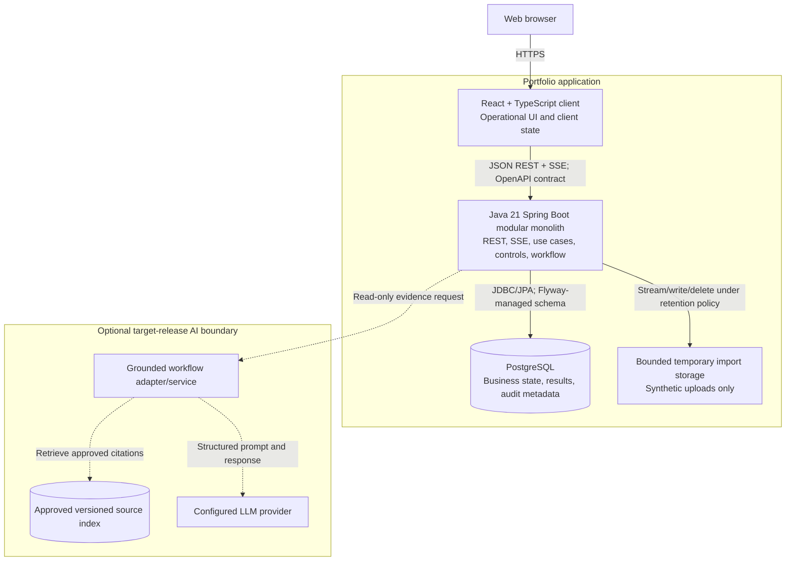
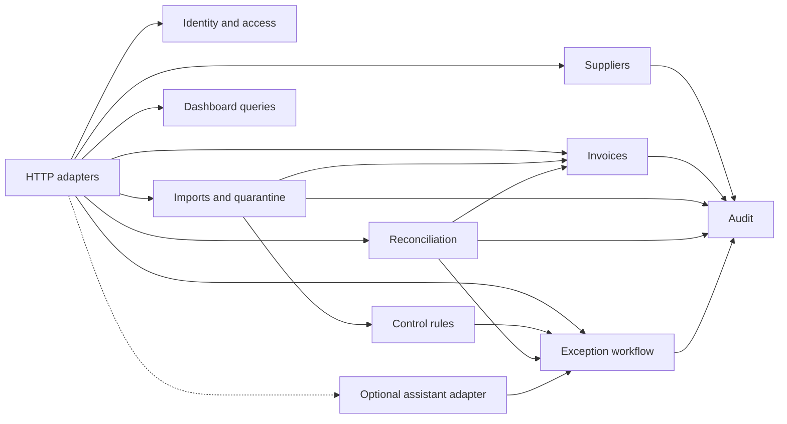

# Container Architecture

Status: Approved foundation architecture

Issue: `IRW-004`

Related decision: [ADR-001](../adr/ADR-001-modular-monolith.md)

## Container diagram

## Spring Boot modules

Arrows represent approved application-service or event dependencies, not permission to access another module's repositories. Exact package dependencies will be enforced after scaffolding.

## Runtime responsibilities

### React client

- routes and accessible operational screens;
- typed OpenAPI client;
- URL-persisted queue state;
- loading, empty, error, conflict, and live-connection states;
- no authoritative financial calculations; and
- no secrets.

### Spring Boot application

- authentication and authorization;
- validation and safe API errors;
- import orchestration and idempotency;
- deterministic controls and reconciliation;
- exception workflow and optimistic locking;
- server-side query operations;
- SSE job events;
- audit-event creation; and
- optional read-only AI adapter.

### PostgreSQL

- transactional business state;
- constraints and relationship integrity;
- server-side filtering, sorting, grouping, and pagination;
- rule and execution versions;
- reconciliation and exception evidence; and
- append-only audit storage protected by database permissions.

### Temporary storage

- bounded synthetic upload lifecycle;
- checksum calculation input;
- no permanent public file serving; and
- documented cleanup and retention.

## Deployment principle

The core MVP has one frontend deployment, one Java application deployment, and one PostgreSQL database. The optional AI boundary is introduced only after an ADR shows that its framework, scaling, or isolation needs justify another process.
