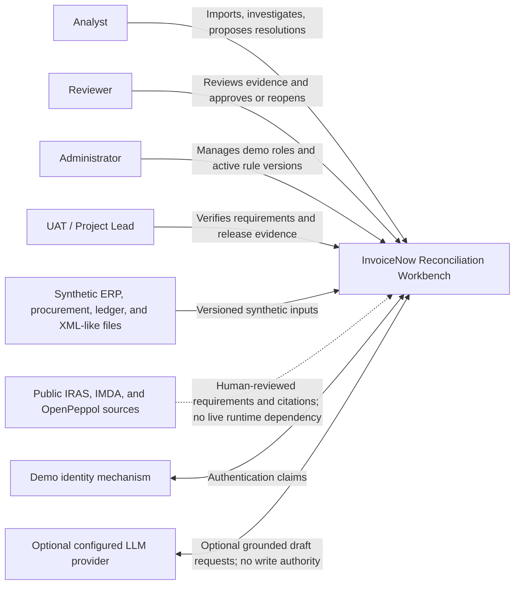

# System Context

Status: Approved foundation architecture

Issue: `IRW-004`

Baseline date: 31 July 2026

## Context diagram

## Boundary notes

- IRAS, IMDA, and OpenPeppol are information sources, not runtime integrations.
- The workbench does not connect to IRAS or the InvoiceNow network.
- All portfolio transaction data is synthetic.
- The identity mechanism will be selected in a later security ADR.
- The LLM provider is outside the MVP and remains disabled until the deterministic system and evaluation controls are complete.
- Human reviewers retain authority over workflow decisions.

## Trust boundaries

1. Browser to application API: authenticate, authorize, validate, rate-limit expensive operations, and return safe errors.
2. Uploaded file to import pipeline: treat every byte as untrusted and apply bounded parsing.
3. Application to PostgreSQL: use least privilege and migrations; the application identity cannot mutate audit history.
4. Application to optional LLM provider: minimize data, validate tool arguments, and send no secrets or unnecessary identifiers.
5. Public sources to rule design: human review and source versioning prevent mutable web content from changing runtime behaviour silently.
