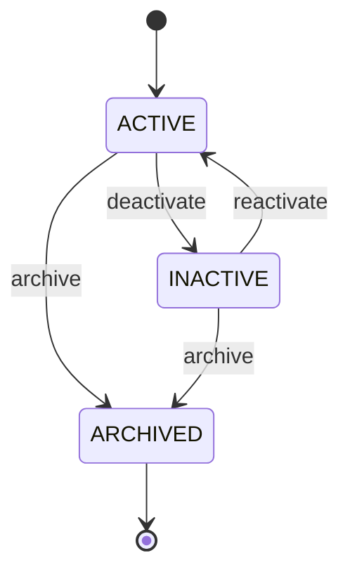

# Supplier Aggregate and Persistence

Status: Implemented under `IRW-101`; local verification passed, pull-request CI pending

## Purpose

The supplier module establishes the first complete domain-to-PostgreSQL boundary.
Invoices will reference suppliers in IRW-102, so this issue defines identity,
normalization, lifecycle, persistence versioning, and database constraints before
an import path exists.

Only synthetic supplier data is valid. This repository does not contain or
accept a live company UEN as a normalized supplier registration identifier.

## Domain model

`Supplier` is an immutable aggregate. A state change returns a new aggregate
with the same `SupplierId`, immutable `SupplierCode`, persistence version, and
creation timestamp. A caller supplies the change timestamp so tests and later
application services can use an injected clock.

Normalized value rules:

- `SupplierCode`: 3 to 32 uppercase ASCII letters, digits, `_`, or `-`; the first
  character is alphanumeric.
- `SupplierName`: nonblank, outer whitespace removed, maximum 200 Unicode code
  points. It remains untrusted display text and must be escaped by output adapters.
- `RegistrationIdentifier`: 9 to 64 supported characters and a mandatory
  `SYNTH-` prefix. `SYNTH-UEN-000001` is valid; `201912345A` is rejected.

The aggregate lifecycle is:



Archived suppliers are terminal and cannot be edited or transitioned. Archive
eligibility based on invoice references is deliberately not guessed here; the
later application service must choose archive versus deactivate after the invoice
relationship exists.

## Persistence boundary

The public `SupplierRepository` application port accepts and returns only domain
types. Its JPA adapter, Spring Data repository, and persistence entity are
package-private. Architecture tests ensure:

- the supplier domain has no Spring, JPA, application, or infrastructure
  dependency; and
- JPA entities are not public API types.

New aggregates have no persistence version. Hibernate assigns version `0` on
insert through the nullable entity `@Version` field; each successful update
increments it. The restored domain aggregate exposes the version as
`OptionalLong` so unsaved and persisted state are not conflated.

## Flyway V2

`V2__create_suppliers.sql` adds `app.suppliers` with:

- UUID primary key;
- unique supplier code and synthetic registration identifier;
- bounded normalized text checks;
- `ACTIVE`, `INACTIVE`, and `ARCHIVED` status check;
- non-negative optimistic-lock version;
- `TIMESTAMP WITH TIME ZONE` creation/update timestamps; and
- a database rule preventing `updated_at < created_at`.

The Java validation improves developer feedback. PostgreSQL repeats critical
invariants so direct SQL, mapping defects, or later application bugs cannot
bypass them.

## Verification

Executed with the committed Maven Wrapper under Java 21:

```powershell
./mvnw --batch-mode --no-transfer-progress "-Dtest=SupplierTest" test
./mvnw --batch-mode --no-transfer-progress "-Dtest=SupplierRepositoryIntegrationTest" test
./mvnw --batch-mode --no-transfer-progress verify
```

Local focused evidence:

- supplier domain suite: 12 tests passed;
- PostgreSQL repository/migration suite: 10 tests passed; and
- clean PostgreSQL 18.4 migration reached Flyway V2.

The complete local repository gate passed 51 tests with no failures, errors, or
skips. This includes four production architecture rules, both Flyway migrations,
Hibernate schema validation, repository versioning, the original health/security
smoke checks, and executable JAR packaging. The independent CI run is recorded
after the pull-request check passes.

## Explicit boundaries

This issue does not add supplier HTTP CRUD, role authorization, audit events,
invoice foreign keys, source-value preservation, or reference-aware archive
selection. These remain separately testable later issues.
